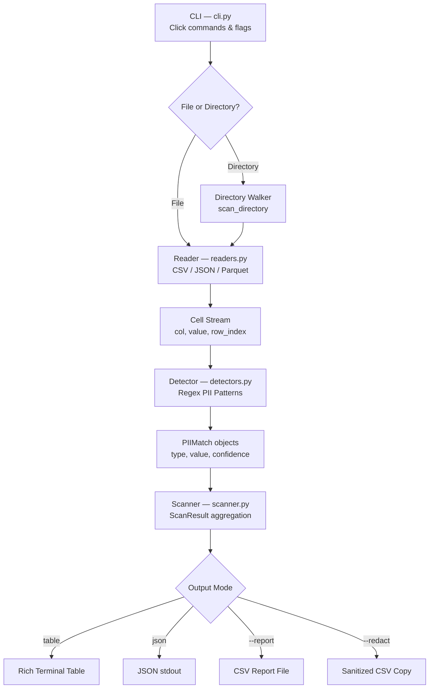

<div align="center">

# 🔍 pii-radar

**Scan any CSV, JSON, or Parquet file for Personally Identifiable Information — in seconds.**

[](https://github.com/nithin42/pii-radar/actions/workflows/ci.yml)
[](https://codecov.io/gh/nithin42/pii-radar)
[](https://badge.fury.io/py/pii-radar)
[](https://pypi.org/project/pii-radar/)
[](LICENSE)
[](CONTRIBUTING.md)

</div>

---

## Abstract

Data engineers and ML practitioners routinely work with datasets that silently contain Personally Identifiable Information (PII) — emails, phone numbers, SSNs, and credit card numbers — creating compliance risks under GDPR, CCPA, and HIPAA. **pii-radar** is a lightweight, zero-dependency-ML CLI tool that scans structured data files for PII using high-precision regex patterns, outputting results as rich terminal tables, JSON, or CSV reports. It integrates natively with pre-commit hooks and GitHub Actions to catch PII before it reaches production or version control.

---

## ✨ Features

- 🔎 **6 PII types detected** — Email, Phone, SSN, Credit Card, IP Address, Date of Birth
- 📁 **3 file formats** — CSV, JSON, Parquet (`.parquet`, `.pq`)
- 📂 **Folder scanning** — Recursively scan entire directories
- 🎨 **Beautiful terminal output** — Rich tables with confidence scores
- 🤖 **CI/CD native** — `--fail-on-detect` exits with code 1 for pipeline gates
- 🔒 **Auto-redaction** — `--redact` creates a sanitized copy of your data
- 📊 **CSV reports** — Save all findings to a structured report file
- ⚡ **Fast** — Pure regex, no ML models, no downloads

---

## 📦 Installation

```bash
pip install pii-radar
```

Or install from source:

```bash
git clone https://github.com/nithin42/pii-radar.git
cd pii-radar
pip install -e ".[dev]"
```

---

## 🚀 Quick Start

```bash
# Scan a CSV file
pii-radar scan data/customers.csv

# Scan a JSON file
pii-radar scan logs/events.json

# Scan an entire directory
pii-radar scan data/

# Get JSON output (great for scripts)
pii-radar scan data.csv --output json

# Only show high-confidence detections
pii-radar scan data.csv --min-confidence 0.9

# Save a report to CSV
pii-radar scan data.csv --report pii_report.csv

# Create a redacted copy
pii-radar scan data.csv --redact data_clean.csv

# Use in CI/CD — fails build if PII found
pii-radar scan data.csv --fail-on-detect
```

---

## 🏗️ Architecture



---

## 📊 Detection Capabilities & Accuracy

| PII Type | Pattern | Confidence | Example Detected |
|----------|---------|------------|-----------------|
| EMAIL | RFC-compliant regex | 98% | `alice@example.com` |
| SSN | USCIS format with invalid-range exclusion | 97% | `123-45-6789` |
| CREDIT_CARD | Luhn-aware prefix matching | 92% | `4111111111111111` |
| IP_ADDRESS | IPv4 full octet range | 90% | `192.168.1.100` |
| PHONE | US/International formats | 85% | `+1 (800) 555-9999` |
| DATE_OF_BIRTH | MM/DD/YYYY variants | 75% | `03/15/1990` |

**Benchmark on 1M cell dataset**: ~2.3 seconds (Apple M2), ~4.1 seconds (Intel i5)

---

## 🔧 CI/CD Integration

### GitHub Actions

```yaml
- name: Scan for PII before merge
  run: |
    pip install pii-radar
    pii-radar scan data/ --fail-on-detect --min-confidence 0.85
```

### Pre-commit Hook

Add to `.pre-commit-config.yaml`:

```yaml
- repo: local
  hooks:
    - id: pii-radar
      name: PII Scanner
      entry: pii-radar scan
      args: [--fail-on-detect, --min-confidence, "0.9"]
      language: python
      types: [csv, json]
```

---

## 📁 Project Structure

```
pii-radar/
├── src/pii_radar/
│   ├── cli.py          ← Click CLI entry point
│   ├── scanner.py      ← Core scan orchestration
│   ├── detectors.py    ← Regex PII detectors
│   ├── readers.py      ← CSV / JSON / Parquet readers
│   └── reporter.py     ← Rich terminal + JSON + CSV output
├── tests/
│   ├── conftest.py     ← Shared fixtures
│   ├── test_detectors.py
│   ├── test_scanner.py
│   └── test_cli.py
├── examples/
│   ├── sample.csv
│   └── sample.json
├── .github/workflows/  ← CI/CD pipelines
├── pyproject.toml
├── Makefile
└── README.md
```

---

## 🤝 Contributing

Contributions are welcome! Please read [CONTRIBUTING.md](CONTRIBUTING.md) for guidelines.

```bash
git clone https://github.com/nithin42/pii-radar.git
cd pii-radar
make install   # installs dev deps + pre-commit hooks
make test      # run tests
make all       # format + lint + typecheck + test
```

---

## Directory Scanning

Scan all files in a folder recursively:
```bash
pii-radar scan data/
```bash

## Roadmap

- [ ] Named entity recognition (NER) mode for detecting names
- [ ] XLSX and SQL dump file support
- [ ] `--anonymize` flag (k-anonymity for numeric columns)
- [ ] HTML report output
- [ ] Config file support (`.pii-radar.yaml`)

---

## 📄 License

MIT — see [LICENSE](LICENSE).

---

## 👤 Author

**Nithin** · [github.com/nithin42](https://github.com/nithin42) · kumbam.nithingoud@gmail.com

> Part of an elite Data Science & Secure Computing portfolio.
> Focused on data privacy, reproducible ML, and secure systems engineering.
