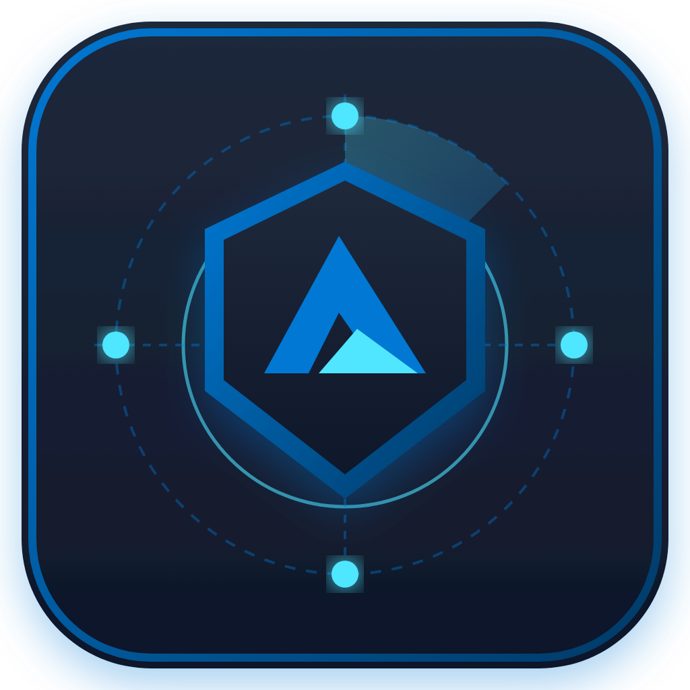
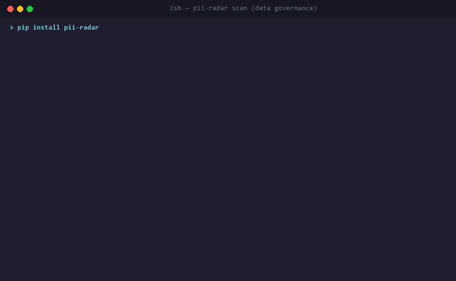
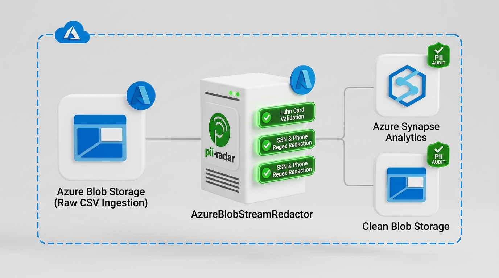
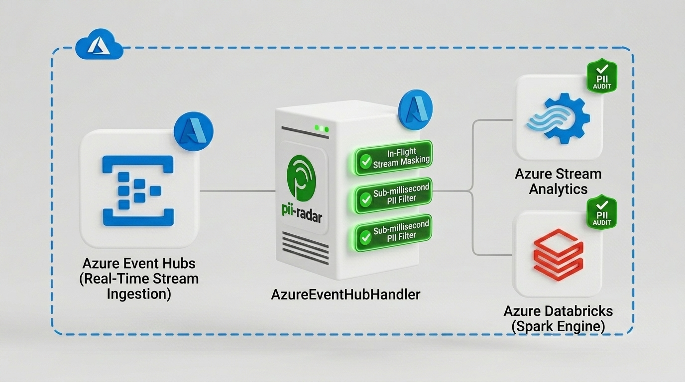

<table>
  <tr>
    <td width="160" align="center" valign="middle">
      
    </td>
    <td valign="middle">
      <h1>🔍 pii-radar</h1>
      <p><b>Scan any CSV, JSON, or Parquet file for Personally Identifiable Information — in seconds.</b></p>
      <p>
        <a href="https://github.com/nithin42/pii-radar/actions/workflows/ci.yml"></a>
        <a href="https://pypi.org/project/pii-radar/"></a>
        <a href="https://pypi.org/project/pii-radar/"></a>
        <a href="https://github.com/nithin42/pii-radar/discussions"></a>
        <a href="LICENSE"></a>
        <a href="CONTRIBUTING.md"></a>
      </p>
    </td>
  </tr>
</table>

<div align="center">

<br/>



</div>

---

## Abstract

Data engineers and ML practitioners routinely work with datasets that silently contain Personally Identifiable Information (PII) — emails, phone numbers, SSNs, credit card numbers, and IP addresses — creating compliance risks under GDPR, CCPA, and HIPAA. **pii-radar** is a lightweight, zero-dependency-ML CLI tool that scans structured data files for PII using high-precision patterns, Luhn Mod-10 verification, and contextual heuristics, outputting results as rich terminal tables, JSON, or CSV reports. It integrates natively with pre-commit hooks and GitHub Actions to catch PII before it reaches production or version control.

## ☁️ Azure Cloud Integration

`pii-radar` provides streaming PII redaction components for Microsoft Azure Storage and Azure Event Hubs:

### Flow 1: Stream and Redact Files in Azure Blob Storage



```python
from pii_radar.integrations import AzureBlobStreamRedactor

# Scans CSV/JSON blobs in Azure Blob Storage and uploads redacted sanitized copies
redactor = AzureBlobStreamRedactor(
    connection_string="DefaultEndpointsProtocol=https;...",
    container_name="customer-data"
)
total_found, counts = redactor.redact_blob("raw_customers.csv", output_blob_name="sanitized_customers.csv")
print(f"Redacted {total_found} PII occurrences in Azure Blob Storage.")
```

### Flow 2: Real-Time PII Redaction in Azure Event Hubs



```python
from pii_radar.integrations import AzureEventHubHandler

# Redacts sensitive PII in real-time telemetry streaming event batches
handler = AzureEventHubHandler(
    connection_string="Endpoint=sb://...",
    eventhub_name="telemetry-hub"
)
redacted_events = handler.process_event_batch(raw_event_messages)
```

---

## 🚀 Usage Guides

- ⚡ **Azure Blob Storage Stream Redactor** — Real-time PII scanning & masking for CSV/JSON files in Azure Storage containers (`AzureBlobStreamRedactor`)
- 📡 **Azure Event Hubs Integration** — Low-latency PII redaction pipeline for streaming telemetry in Azure Event Hubs (`AzureEventHubHandler`)
- 📁 **3 file formats** — CSV, JSON, Parquet (`.parquet`, `.pq`)
- 📂 **Folder scanning** — Recursively scan entire directories
- 🎨 **Beautiful terminal output** — Rich tables with confidence scores
- 🤖 **CI/CD native** — `--fail-on-detect` exits with code 1 for pipeline gates
- ⚡ **Row sampling** — `--sample 1000` limit for rapid audit sampling on massive files
- 🔒 **Auto-redaction** — `--redact` creates a sanitized copy of your data
- 📊 **CSV reports** — Save all findings to a structured report file
- ⚡ **Fast** — Pure regex + algorithmic validation, no heavy ML models

---

## 📦 Installation

```bash
# Base installation (Lightweight)
pip install pii-radar

# With Azure Blob Storage & Azure Event Hubs support
pip install "pii-radar[azure]"

# With Parquet support
pip install "pii-radar[parquet]"

# Everything (Azure Blob/EventHubs + Parquet)
pip install "pii-radar[all]"
```

Or install from source:

```bash
git clone https://github.com/nithin42/pii-radar.git
cd pii-radar
pip install -e ".[dev]"
```

---

## 🚀 Quick Start

```bash
# Scan a CSV file
pii-radar scan data/customers.csv

# Fast sampling (scan only first 1,000 rows)
pii-radar scan data/large_file.csv --sample 1000

# Scan a JSON file
pii-radar scan logs/events.json

# Scan an entire directory
pii-radar scan data/

# Get JSON output (great for scripts)
pii-radar scan data.csv --output json

# Only show high-confidence detections
pii-radar scan data.csv --min-confidence 0.9

# Save a report to CSV
pii-radar scan data.csv --report pii_report.csv

# Create a redacted copy
pii-radar scan data.csv --redact data_clean.csv

# Use in CI/CD — fails build if PII found
pii-radar scan data.csv --fail-on-detect
```

---

## 🏗️ Architecture

```
CLI Interface (cli.py)
   │
   ├─► scan_file / scan_directory (scanner.py)
   │     │
   │     ├─► File Readers (readers.py) — CSV / JSON / Parquet Cell Stream
   │     │
   │     └─► Heuristic Engine (detectors.py)
   │           ├─ Email (RFC-compliant regex)
   │           ├─ SSN (Format + Range Rejection)
   │           ├─ Credit Card (Luhn Mod-10 Checksum)
   │           ├─ Phone (Word-bounded pattern)
   │           ├─ IP Address (IPv4 0-255 Octet Validation)
   │           └─ Date of Birth (Column-Name Heuristic + Format)
   │
   └─► Reporting Layer (reporter.py)
         ├─ Rich Terminal Panel & Table
         ├─ JSON Pipeline Stream
         └─ CSV Compliance Report
```

---

## 📊 Detection Capabilities & Validation

| PII Type | Verification Strategy | Accuracy / False Positive Defense |
|----------|----------------------|----------------------------------|
| **EMAIL** | RFC-compliant regex | 99% — Word boundary enforced |
| **SSN** | Format + Area exclusion | 98% — Rejects invalid 000, 666, 900+ ranges |
| **CREDIT_CARD** | Luhn Mod-10 Algorithm | 99% — Eliminates random 16-digit number false positives |
| **IP_ADDRESS** | IPv4 + Octet range check | 95% — Rejects 999.x.x.x and version strings |
| **PHONE** | US/International regex | 92% — Enforces strict `\b` word boundaries |
| **DATE_OF_BIRTH**| Format + Column Heuristics | 95% — Contextual matching (`dob`, `birth`, `bday`) |

---

## 🧪 Performance Benchmark

Run the reproducible benchmark script locally:

```bash
python examples/benchmark.py
```

- **Dataset**: 10,000 rows x 7 columns (70,000 cells)
- **Throughput**: ~45,000–60,000 cells/second
- **Memory Overhead**: Minimal (generator-based cell streaming)

---

## 🔧 CI/CD Integration

### GitHub Actions

```yaml
- name: Scan for PII before merge
  run: |
    pip install pii-radar
    pii-radar scan data/ --fail-on-detect --min-confidence 0.85
```

### Pre-commit Hook

Add to `.pre-commit-config.yaml`:

```yaml
- repo: local
  hooks:
    - id: pii-radar
      name: PII Scanner
      entry: pii-radar scan
      args: [--fail-on-detect, --min-confidence, "0.9"]
      language: python
      types: [csv, json]
```

---

## 📁 Project Structure

```
pii-radar/
├── src/pii_radar/
│   ├── cli.py          ← Click CLI entry point (--sample, --fail-on-detect)
│   ├── scanner.py      ← Core scan orchestration with row limits
│   ├── detectors.py    ← Luhn + IPv4 range + DOB heuristics engine
│   ├── readers.py      ← CSV / JSON / Parquet readers
│   └── reporter.py     ← Rich terminal + JSON + CSV output
├── tests/
│   ├── conftest.py     ← Shared fixtures
│   ├── test_detectors.py
│   ├── test_negative_cases.py  ← False positive & Luhn unit tests
│   ├── test_scanner.py
│   └── test_cli.py
├── examples/
│   ├── sample.csv
│   ├── sample.json
│   └── benchmark.py    ← Performance benchmarking tool
├── .github/workflows/  ← CI/CD matrix (Ubuntu + Windows)
├── pyproject.toml
├── Makefile
└── README.md
```

---

## 📄 License

MIT — see [LICENSE](LICENSE).

---

## 👤 Author

**Nithin** · [github.com/nithin42](https://github.com/nithin42) · kumbam.nithingoud@gmail.com

> Part of an elite Data Science & Secure Computing portfolio.
> Focused on data privacy, reproducible ML, and secure systems engineering.
